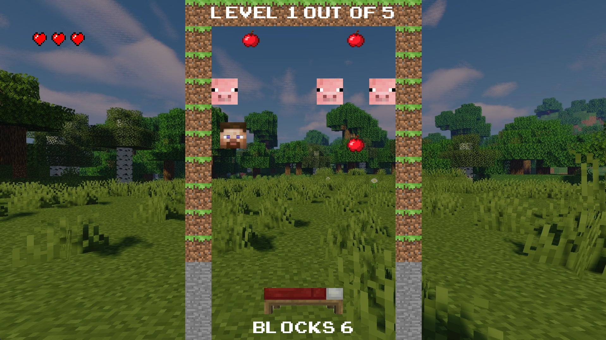
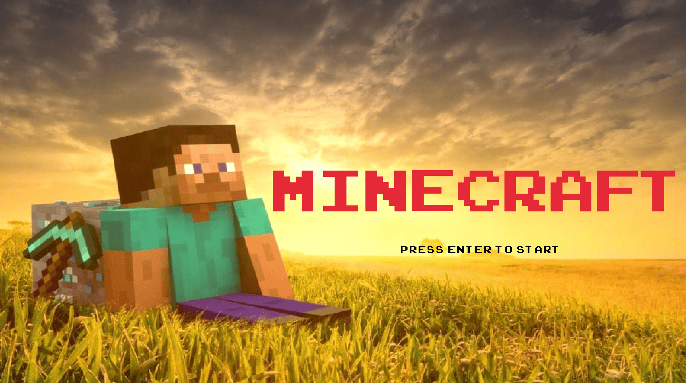
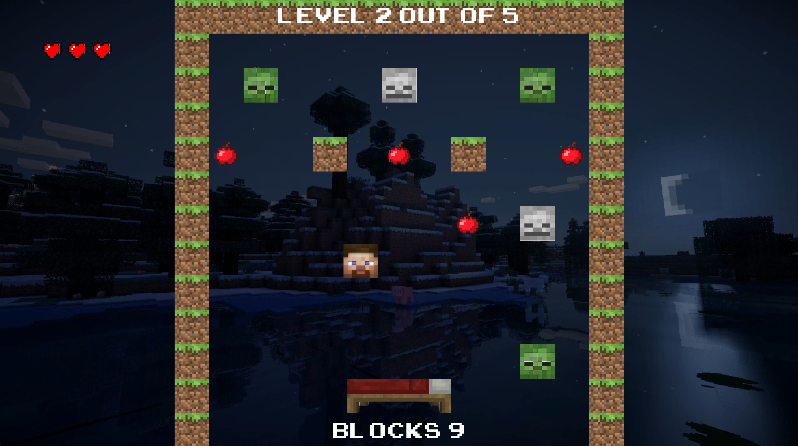
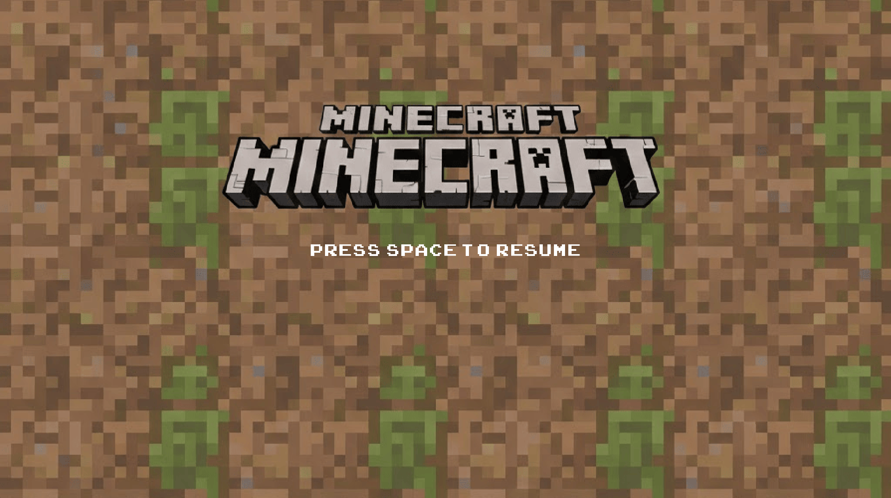
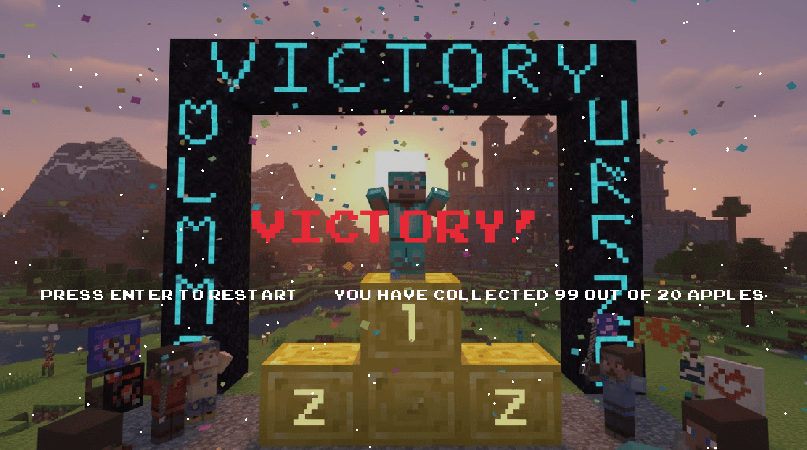

# Simple Breakout

---

The primary goal of this project is to build a simple [Breakout](https://en.wikipedia.org/wiki/Breakout_(video_game)) game written in C++ using the [raylib](https://www.raylib.com) graphics library. In this game, the player controls a paddle that keeps the ball within the level, which destroys blocks upon contact. The objective of the game is to navigate through a series of levels, cleaning all levels of blocks.

The project is developed as a story-driven game based on Minecraft, where completing the game is the main condition for winning.

The game consists of five interconnected levels linked by a single storyline. Each level increases in difficulty and challenges the player’s reaction.

---

## Core Requirements Have Passed

* **Title or Menu Screen**: The game starts with a title screen featuring a game logo and a message to start the game.

* **Game Screen**: From the title screen, the player is able to start the game. The game screen displays the paddle, the ball, and the level. The player moves the paddle using the keyboard. The goal is to move from one level to the next by destroying all the blocks in every level. In our game, the objective of the player is to reach the end by passing through all the levels.

* **Pause Screen**: The player is able to pause the game by pressing the Space key. A 'Pause' screen appears with an option to resume the game. Pressing the Space key resumes the game.

* **Victory Screen**: Upon passing through all the levels, a victory screen displays a congratulatory message, allowing the player to return to the title screen.

## Additional Requirements Have Passed

* **Additional Levels**: There are three extra levels in the game. These levels are more challenging than the previous ones.

* **Additional Game Elements**: IThere are four elements in the game. These include collectibles, availability to move the paddle upside and down, special time events and presence of player's lives.

* **Game Over Screen**: There is *a 'Game Over' screen* that displays a message when the player loses the game, when the player runs out of lives. This screen allows the player to return to the title screen and try again.

* **Additional Sounds**: There are *three new sounds* in the game. These sounds accompany actions like bouncing off paddle, picking up collectibles, and hitting the mobs.

* **Background Music**: There is *a music track* in the game. The music file has stored in the `data/music/` directory and kept reasonably sized.

## Practical Requirements Have Passed

* The code developed **independently of my peers** and maintained a **detailed project commit history**. I am aware that points will be withheld for any suspicion of code plagiarism, even if it's unfounded.

* I Have rewritten the `Readme.md` file with a description of my game and a list of the features that I have implemented.

* I have ensured that the game is playable and contains all necessary files. **It is straightforward for the instructor to set up and start the game with minimal effort.**